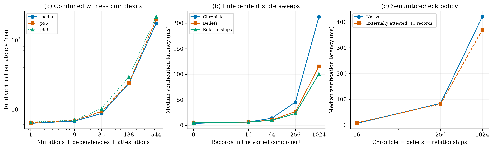
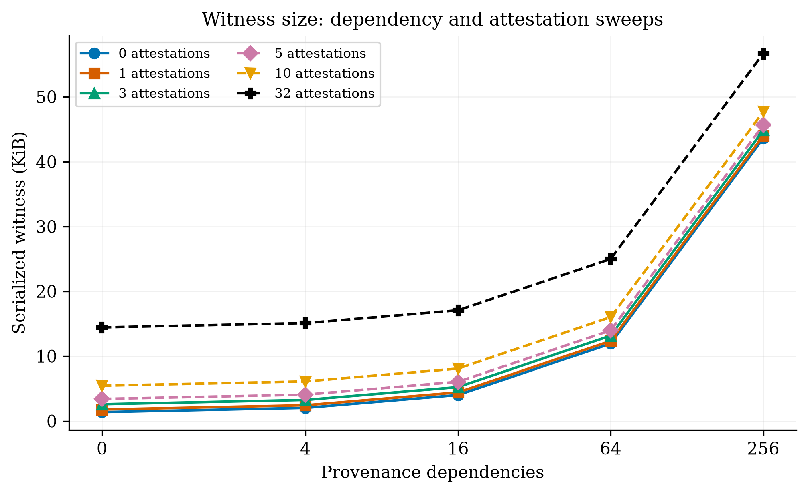

# CCT verifier overhead characterization

Executed 2026-09-09T07:37:25.228772+00:00 to 2026-09-09T07:59:49.568463+00:00. 60 distinct valid workloads; 18,000 measured full verifications. 10 warmups and 300 measured repetitions per case and component, split across 5 randomized blocks in one sequential process. Measurement phase: 1338.4 s. All measured verdicts: VALID.

This is an unoptimized reference-verifier microbenchmark. It characterizes verifier overhead on parsed, resident synthetic inputs; it does not establish production throughput, a service-level latency bound, external evaluator latency, or open-world semantic correctness. No verifier, canonicalization, cryptographic or mutation-engine implementation was optimized for this run.

## Execution and reproducibility

```sh
make performance-benchmark

# Regenerate figures/tables from the recorded samples, without retiming
.venv/bin/python figures/gen_fig_verifier_performance.py
```

Configuration: seed `20260904`; quantiles `numpy.quantile(method='linear')`. Samples are retained without outlier removal or overhead subtraction. p95/p99 are empirical, interpolated quantiles; with 300 repetitions the upper 1% contains only about 3 observations. They are not confidence bounds or stable deployment-tail estimates.

CPU: **arm**; 10 logical CPUs; RAM: None bytes. OS: `macOS-26.5.2-arm64-arm-64bit`. Python: `3.12.14 (main, Aug 25 2026, 13:50:33) [Clang 22.1.3 ]` (CPython). Cryptographic backend: `OpenSSL 4.0.2 25 Aug 2026`.

| Library | Version |
| --- | --- |
| cctbench | 0.2.0 |
| rfc8785 | 0.1.4 |
| cryptography | 50.0.1 |
| pydantic | 2.13.5 |
| numpy | 2.5.2 |
| matplotlib | 3.11.1 |

Process ID `70788`; Python active threads `1`; GC enabled `True`, thresholds `[700, 10, 10]`. Thread-limit environment: `{'MKL_NUM_THREADS': '1', 'OMP_NUM_THREADS': '1', 'OPENBLAS_NUM_THREADS': '1', 'VECLIB_MAXIMUM_THREADS': '1'}`. CPU affinity: `None`. Start/end load averages: `[3.37060546875, 2.9052734375, 2.412109375]` / `[2.39013671875, 2.49560546875, 2.6865234375]`. Median empty timer-pair cost: 41 ns (not subtracted).

One sequential Python process, no workers, parsed resident inputs, fixed seed and payload sizes; GC and verifier unchanged. Case order reshuffled per block; component order reshuffled per iteration. Full-call samples collected separately before component samples within each case/block. No clock pinning, CPU isolation or cache flushing. No network or signing in timed regions.

Dedicated benchmark process only, not an exclusive host. Scheduler placement, background OS/apps, power mode, frequency and temperature were not controlled. No production throughput inference.

Inputs and signatures are deterministic under the source, dependency and seed freeze; timings vary between runs. One benchmark process performs every timed operation; no other benchmark/test workload is launched by the runner. This local desktop was not converted into an isolated or fixed-frequency measurement appliance.

Verifier/engine/schema/crypto freeze: `ee38b07bd63ff902984aca5965709e4f578b7a62c0b50041ee107210c5c8f7d0`. Full benchmark source freeze: `46072b3fa31b338d3101e5260b047685df1b9dfbd0b53529a7dff0cb5f25122c`. Files were checked unchanged after measurement.

## Workload construction and timing boundaries

The default source state has 16 chronicle events, 16 beliefs, 16 relationships, one non-amendable rule, and the generator's fixed governance, knowledge and working memory. Chronicle content and each dependency payload contain 128 ASCII characters. Event/record IDs use fixed-width indices. Native semantic scans validate unchanged chronicle/belief/relationship records; this does not cover every mutation family, deletion, tombstone, adverse evidence or early-failure path.

Mutations are ordered UPDATE_RUNTIME_CONFIG writes to one existing setting, with distinct operation IDs. The candidate's serialized size stays fixed in the mutation sweep. Dependencies are distinct, cited, digest-verified documents in the trusted in-memory resolver snapshot. They do not require network access. One runtime authority signature and one kernel receipt signature are always verified; each selected validation record adds a real Ed25519 verification.

Attestation-count and size-grid cases replace only I_bel with an external check for positive counts and use quorum 1, allowing the requested single-record case. The zero-record point uses native semantics. All positive records are authenticated PASS votes by distinct evaluators. The full semantic comparison replaces all five predicates using ten records (two independent signers per predicate, quorum 2). Each one-predicate comparison uses two records and quorum 1. The native predicates are also validated before timing to check the synthetic PASS assertions. The native and attested policies have different trust assumptions; attestation verification excludes the work and communication required to produce those attestations.

Fixture generation, signing, serialization, parsing, disk I/O, and initial validity checks are outside timed regions. The full-call timer includes all five verifier stages, repeated hashing, existing signature/stage instrumentation, and report construction. GC remains in its original state and caches are not flushed. Inputs are reused. Full-call samples precede separately warmed component samples within each case/block; component order is shuffled each repetition. Direct component timings overlap work in other components and are **not additive**. A native component measured on an attested workload is counterfactual and is excluded from that workload's full-call path. The effective component chooses the policy-selected implementation.

Witness bytes are compact RFC 8785 JSON of the normalized TransitionWitness, including core and signed receipt, with no tag wrapper or transport compression. They exclude predecessor/candidate states, trusted policy/context, resolved evidence and external attestation-generation traffic. Separate state/context byte counts appear in scaling.csv. Nanoseconds are timer units, not accuracy claims.

## Total verification versus witness complexity

Complexity here is the explicit count tuple (mutations, dependencies, attestations). The plotted sum is an index, not a claim that these operations have equal cost. Chronicle, belief and relationship counts stay at 16 in this sweep. All latency triples below are **median / p95 / p99 in milliseconds**.

| Mutations | Dependencies | Attestations | Witness bytes | Total latency (ms) |
| ---: | ---: | ---: | ---: | ---: |
| 1 | 0 | 0 | 1,407 | 6.2103 / 6.3519 / 6.4394 |
| 4 | 4 | 1 | 2,963 | 6.7003 / 6.8610 / 6.9015 |
| 16 | 16 | 3 | 7,687 | 8.6180 / 9.2008 / 10.1391 |
| 64 | 64 | 10 | 26,165 | 23.3979 / 23.6575 / 29.1692 |
| 256 | 256 | 32 | 97,569 | 172.9228 / 196.5572 / 216.1248 |



[Vector PDF](../results/performance/verifier_scaling.pdf). Error/tail lines are empirical quantiles, not confidence intervals.

## Independent sweeps

Each sweep varies the named dimension and fixes the others at the default state, one mutation, zero dependencies and zero attestations, except that positive attestation counts select external I_bel.

### Mutations

| Count | Witness bytes | Predecessor bytes | Total latency (ms) |
| ---: | ---: | ---: | ---: |
| 1 | 1,407 | 12,976 | 6.2103 / 6.3519 / 6.4394 |
| 4 | 1,872 | 12,976 | 6.3121 / 6.5751 / 7.4770 |
| 16 | 3,732 | 12,976 | 6.6386 / 6.7782 / 10.0326 |
| 64 | 11,172 | 12,976 | 7.8415 / 8.0096 / 8.0872 |
| 256 | 40,932 | 12,976 | 12.9651 / 13.2272 / 33.6895 |

### Dependencies

| Count | Witness bytes | Predecessor bytes | Total latency (ms) |
| ---: | ---: | ---: | ---: |
| 0 | 1,407 | 12,976 | 6.2103 / 6.3519 / 6.4394 |
| 4 | 2,081 | 12,976 | 6.3944 / 6.6301 / 6.8554 |
| 16 | 4,109 | 12,976 | 6.7892 / 6.9530 / 7.7247 |
| 64 | 12,221 | 12,976 | 8.3953 / 8.5899 / 13.8313 |
| 256 | 44,669 | 12,976 | 14.7925 / 15.0874 / 15.2744 |

### Attestations

| Count | Witness bytes | Predecessor bytes | Total latency (ms) |
| ---: | ---: | ---: | ---: |
| 0 | 1,407 | 12,976 | 6.2103 / 6.3519 / 6.4394 |
| 1 | 1,824 | 12,976 | 6.3929 / 6.5120 / 6.5769 |
| 3 | 2,660 | 12,976 | 6.8552 / 7.0232 / 7.3036 |
| 5 | 3,496 | 12,976 | 7.2999 / 7.4610 / 7.5651 |
| 10 | 5,586 | 12,976 | 8.3710 / 8.7074 / 9.4469 |
| 32 | 14,782 | 12,976 | 13.2237 / 13.8877 / 14.6058 |

### Chronicle

| Count | Witness bytes | Predecessor bytes | Total latency (ms) |
| ---: | ---: | ---: | ---: |
| 0 | 1,407 | 6,561 | 3.6902 / 3.7787 / 3.8280 |
| 16 | 1,407 | 12,976 | 6.2103 / 6.3519 / 6.4394 |
| 64 | 1,407 | 32,224 | 13.8722 / 15.1331 / 35.5407 |
| 256 | 1,407 | 109,216 | 45.4531 / 66.9531 / 74.1354 |
| 1024 | 1,407 | 417,184 | 212.7964 / 220.1277 / 243.9299 |

### Beliefs

| Count | Witness bytes | Predecessor bytes | Total latency (ms) |
| ---: | ---: | ---: | ---: |
| 0 | 1,407 | 10,433 | 4.8744 / 5.0592 / 7.5826 |
| 16 | 1,407 | 12,976 | 6.2103 / 6.3519 / 6.4394 |
| 64 | 1,407 | 20,608 | 10.3690 / 10.5472 / 15.8131 |
| 256 | 1,407 | 51,136 | 26.7875 / 33.9151 / 51.3006 |
| 1024 | 1,407 | 173,248 | 115.3768 / 119.3598 / 120.8662 |

### Relationships

| Count | Witness bytes | Predecessor bytes | Total latency (ms) |
| ---: | ---: | ---: | ---: |
| 0 | 1,407 | 10,545 | 5.1411 / 7.0651 / 9.6484 |
| 16 | 1,407 | 12,976 | 6.2103 / 6.3519 / 6.4394 |
| 64 | 1,407 | 20,272 | 9.6548 / 9.8568 / 11.3629 |
| 256 | 1,407 | 49,456 | 22.9860 / 37.8722 / 46.8969 |
| 1024 | 1,407 | 166,192 | 100.8840 / 124.7397 / 152.8945 |

## Witness size versus dependencies and attestations

Serialized witness bytes; one mutation and 16 entries in each varied state component. Every grid cell is measured, not extrapolated.

| Dependencies \ attestations | 0 | 1 | 3 | 5 | 10 | 32 |
| ---: | ---: | ---: | ---: | ---: | ---: | ---: |
| 0 | 1,407 | 1,824 | 2,660 | 3,496 | 5,586 | 14,782 |
| 4 | 2,081 | 2,498 | 3,334 | 4,170 | 6,260 | 15,456 |
| 16 | 4,109 | 4,526 | 5,362 | 6,198 | 8,288 | 17,484 |
| 64 | 12,221 | 12,638 | 13,474 | 14,310 | 16,400 | 25,596 |
| 256 | 44,669 | 45,086 | 45,922 | 46,758 | 48,848 | 58,044 |



[Vector PDF](../results/performance/witness_size.pdf).

## Native and externally attested semantics

Same predecessor, proposal and candidate at each state size; only validation records, receipt and trusted evaluator policy/context differ. N is the count of each of chronicle events, beliefs and relationships.

| N | Semantic policy | Attestations | Total latency (ms) |
| ---: | --- | ---: | ---: |
| 16 | native | 0 | 6.2103 / 6.3519 / 6.4394 |
| 16 | all | 10 | 8.0637 / 8.7075 / 9.7577 |
| 256 | native | 0 | 83.6811 / 109.0064 / 110.1409 |
| 256 | all | 10 | 81.0760 / 104.2423 / 108.8643 |
| 1024 | native | 0 | 420.9696 / 439.1039 / 453.7640 |
| 1024 | all | 10 | 369.9914 / 387.5813 / 405.3047 |

One-predicate replacement at N = 256; other four predicates remain native.

| Replaced predicate | Records | Total latency (ms) | Effective predicate latency (ms) |
| --- | ---: | ---: | ---: |
| I_bel | 2 | 83.3691 / 108.7446 / 110.0420 | 0.4250 / 0.4690 / 0.4816 |
| I_hist | 2 | 78.4899 / 102.9021 / 115.1169 | 0.4274 / 0.4713 / 0.5783 |
| I_norm | 2 | 84.5292 / 109.4807 / 118.5696 | 0.4265 / 0.4746 / 0.5136 |
| I_rel | 2 | 84.0297 / 108.9452 / 121.5163 | 0.4272 / 0.4789 / 0.5216 |
| I_temp | 2 | 83.4072 / 108.0621 / 112.8240 | 0.4264 / 0.4717 / 0.4971 |
| native | 0 | 83.6811 / 109.0064 / 110.1409 | — |

## Component measurements

Baseline `m1-d0-a0-h16-b16-r16-native` versus largest combined witness `m256-d256-a32-h16-b16-r16-I_bel`. Triples are milliseconds. Primitive signatures are pooled individual calls; the sum is per full verification. All per-case component quantiles and exact sample counts are in summary.csv.

| Measurement | Baseline (ms) | Largest witness (ms) |
| --- | ---: | ---: |
| authority_check | 0.1905 / 0.2012 / 0.2093 | 5.2197 / 5.3986 / 7.7365 |
| core_digest | 0.0452 / 0.0486 / 0.0557 | 5.0503 / 5.1797 / 7.7359 |
| effective_I_bel | 0.0445 / 0.0462 / 0.0491 | 150.4101 / 174.3343 / 178.3096 |
| effective_I_hist | 0.3506 / 0.3645 / 0.3818 | 0.3559 / 0.3821 / 0.4095 |
| effective_I_norm | 0.0253 / 0.0274 / 0.0319 | 0.0279 / 0.0325 / 0.0511 |
| effective_I_rel | 0.0197 / 0.0219 / 0.0248 | 0.0214 / 0.0267 / 0.0300 |
| effective_I_temp | 0.0065 / 0.0071 / 0.0084 | 0.0091 / 0.0153 / 0.0185 |
| native_I_bel | 0.0445 / 0.0462 / 0.0491 | 0.0519 / 0.0602 / 0.0667 |
| native_I_hist | 0.3506 / 0.3645 / 0.3818 | 0.3559 / 0.3821 / 0.4095 |
| native_I_norm | 0.0253 / 0.0274 / 0.0319 | 0.0279 / 0.0325 / 0.0511 |
| native_I_rel | 0.0197 / 0.0219 / 0.0248 | 0.0214 / 0.0267 / 0.0300 |
| native_I_temp | 0.0065 / 0.0071 / 0.0084 | 0.0091 / 0.0153 / 0.0185 |
| proposal_digest | 0.0414 / 0.0450 / 0.0498 | 4.5288 / 4.6392 / 5.1684 |
| provenance_check | 0.0015 / 0.0020 / 0.0025 | 1.2051 / 1.2505 / 1.2907 |
| receipt_signature_check | 0.1648 / 0.1748 / 0.1849 | 0.1683 / 0.1836 / 0.2010 |
| signature_primitive | 0.1500 / 0.1587 / 0.1677 | 0.1512 / 0.1627 / 0.1743 |
| signature_primitive_sum | 0.3001 / 0.3139 / 0.3214 | 5.1741 / 5.4891 / 6.3299 |
| stage_1_lineage | 2.1569 / 2.2179 / 2.2753 | 11.7260 / 12.0599 / 12.4576 |
| stage_2_authority | 0.1925 / 0.2058 / 0.2172 | 5.2251 / 5.4195 / 5.9405 |
| stage_3_provenance | 0.0025 / 0.0030 / 0.0040 | 1.2080 / 1.2715 / 1.5250 |
| stage_4_state_application | 2.1180 / 2.1810 / 2.2338 | 2.2269 / 2.3471 / 2.5985 |
| stage_5_semantics | 0.4507 / 0.4719 / 0.5137 | 151.1138 / 174.2286 / 192.4716 |
| state_application | 0.8416 / 0.8747 / 0.9059 | 0.9200 / 0.9903 / 1.0348 |
| state_hash_candidate | 0.6352 / 0.6646 / 0.6823 | 0.6484 / 0.6889 / 0.7349 |
| state_hash_predecessor | 0.6349 / 0.6603 / 0.6784 | 0.6485 / 0.6940 / 0.7819 |
| total_cct | 6.2103 / 6.3519 / 6.4394 | 172.9228 / 196.5572 / 216.1248 |
| total_process_cpu | 6.2105 / 6.3493 / 6.4371 | 172.8850 / 196.3181 / 207.8155 |

### Measurement definitions

- `authority_check_ns`: Direct check_authority: grants, scopes, threshold, authority payload construction, hashing and signatures.
- `core_digest_ns`: compute_core_digest(core), including normalization, tagged JCS and SHA-256.
- `effective_I_bel_ns`: Policy-selected I_bel component: check_attestation if required, otherwise the same sample as native_I_bel.
- `effective_I_hist_ns`: Policy-selected I_hist component: check_attestation if required, otherwise the same sample as native_I_hist.
- `effective_I_norm_ns`: Policy-selected I_norm component: check_attestation if required, otherwise the same sample as native_I_norm.
- `effective_I_rel_ns`: Policy-selected I_rel component: check_attestation if required, otherwise the same sample as native_I_rel.
- `effective_I_temp_ns`: Policy-selected I_temp component: check_attestation if required, otherwise the same sample as native_I_temp.
- `native_I_bel_ns`: Direct native I_bel predicate. Counterfactual in externally attested cases; not executed in that case's total verifier path.
- `native_I_hist_ns`: Direct native I_hist predicate. Counterfactual in externally attested cases; not executed in that case's total verifier path.
- `native_I_norm_ns`: Direct native I_norm predicate. Counterfactual in externally attested cases; not executed in that case's total verifier path.
- `native_I_rel_ns`: Direct native I_rel predicate. Counterfactual in externally attested cases; not executed in that case's total verifier path.
- `native_I_temp_ns`: Direct native I_temp predicate. Counterfactual in externally attested cases; not executed in that case's total verifier path.
- `proposal_digest_ns`: compute_proposal_digest(q), including normalization, tagged JCS and SHA-256.
- `provenance_check_ns`: Direct check_provenance: declarations, in-memory resolver lookups and evidence hashes; no network I/O.
- `receipt_signature_check_ns`: verify_signature for one receipt: prepared unsigned payload, key/signature decoding, tagged hash, Ed25519 verification and historical key checks.
- `signature_primitive_ns`: Individual Ed25519 primitive timings from full verification, pooled per case across actual calls; call index preserved in signature_samples.csv.
- `signature_primitive_sum_ns`: Sum of Ed25519 primitive timings captured inside this full verification; excludes key parsing and message hashing, includes existing timer bookkeeping overhead.
- `stage_1_lineage_ns`: Existing verifier stage timer; includes diagnostic condition construction. Components/stages overlap and must not be summed with other metrics.
- `stage_2_authority_ns`: Existing verifier stage timer; includes diagnostic condition construction. Components/stages overlap and must not be summed with other metrics.
- `stage_3_provenance_ns`: Existing verifier stage timer; includes diagnostic condition construction. Components/stages overlap and must not be summed with other metrics.
- `stage_4_state_application_ns`: Existing verifier stage timer; includes diagnostic condition construction. Components/stages overlap and must not be summed with other metrics.
- `stage_5_semantics_ns`: Existing verifier stage timer; includes diagnostic condition construction. Components/stages overlap and must not be summed with other metrics.
- `state_application_ns`: apply_mutations: deep state copy, ordered operations and final state hash. Candidate equality checks belong to stage 4, not this component.
- `state_hash_candidate_ns`: compute_state_digest(candidate), same boundary as predecessor hash.
- `state_hash_predecessor_ns`: compute_state_digest(predecessor): model projection, normalization, tagged RFC 8785 JCS and SHA-256; derived state_digest excluded.
- `total_cct_ns`: External wall clock around the complete diagnostic verifier, including report construction; parsed objects and resident evidence.
- `total_process_cpu_ns`: Process CPU time around the same call, including the two wall-clock reads; diagnostic only, not used for latency plots.

## Interpretation and limits

Median full verification ranged from 3.690 to 420.970 ms across this grid. These values show the latency budget the current diagnostic implementation consumes on this host and these resident workloads. Operational acceptability depends on an application's transition frequency, state distribution and latency requirements; this experiment sets no universal pass/fail threshold.

The isolated dependencies sweep moved from 6.2103 / 6.3519 / 6.4394 ms at 0 to 14.7925 / 15.0874 / 15.2744 ms at 256. This is an observed endpoint comparison under the stated policies, not an additive causal decomposition.

The isolated attestations sweep moved from 6.2103 / 6.3519 / 6.4394 ms at 0 to 13.2237 / 13.8877 / 14.6058 ms at 32. This is an observed endpoint comparison under the stated policies, not an additive causal decomposition.

Lineage's stage timer includes state/proposal/core binding hashes, receipt verification and canonical-head checks. Signature primitive timing excludes preimage hashing and key parsing, while authority and attestation resolution include those costs. State application includes a deep copy and state digest. Repeated work remains in the baseline. Native history and temporal checks perform scans of retained records; these costs can dominate larger state cases. The existing attestation resolver recomputes the proposal digest while validating each record, so combined witness growth can cost more than signature verification alone. No implementation changes were made to reduce these costs.

Limitations: a single host/session and synthetic transition family, warm resident inputs, modest record sizes, no evidence-service I/O, no external evaluator execution, no persistence, no key-service access, no concurrency, and no adversarial/failure-latency distribution. GC, scheduler and background-load noise remain visible. No transactions-per-second or production throughput claim is derived from reciprocal latency.

## Auditable artifacts

- [manifest.json](../results/performance/manifest.json)
- [environment.json](../results/performance/environment.json)
- [workloads.jsonl](../results/performance/workloads.jsonl)
- [samples.jsonl](../results/performance/samples.jsonl)
- [signature_samples.csv](../results/performance/signature_samples.csv)
- [summary.csv](../results/performance/summary.csv)
- [scaling.csv](../results/performance/scaling.csv)
- [cases.json](../results/performance/cases.json)
